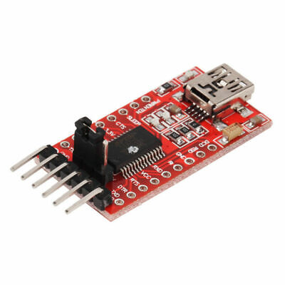

# Programación de la estación

En esta sección se describen los programas y la metodología utilizada para programar la estación meteorológica.

Para habilitar la comunicación LoRaWAN con el transceptor **SX1262**, se utilizó la biblioteca **RadioLib**.

---

## Requerimientos para programación

Para cargar el firmware en la estación, es necesario contar con un módulo **FT232** (conversor USB a UART), que permite que la computadora reconozca la placa y posibilita la programación mediante el **Arduino IDE**.

  

---

## Programas disponibles

- **Versión 2**  
Actualmente se dispone de un programa que permite la comunicación mediante LoRaWAN e incluye la inicialización de todos los sensores.  
El código está en desarrollo, por lo que se planea estructurarlo mejor y optimizar su orden para facilitar mantenimiento y futuras mejoras.

---

## Formato de trama

El formato de trama utilizado para la comunicación está basado en el protocolo **VMTP** (Variable Meteorological Transmission Protocol), desarrollado por estudiantes de la Universidad de Cuenca [2].  

La trama implementada es una modificación personalizada de VMTP, adaptada a las necesidades específicas de esta estación.

  

